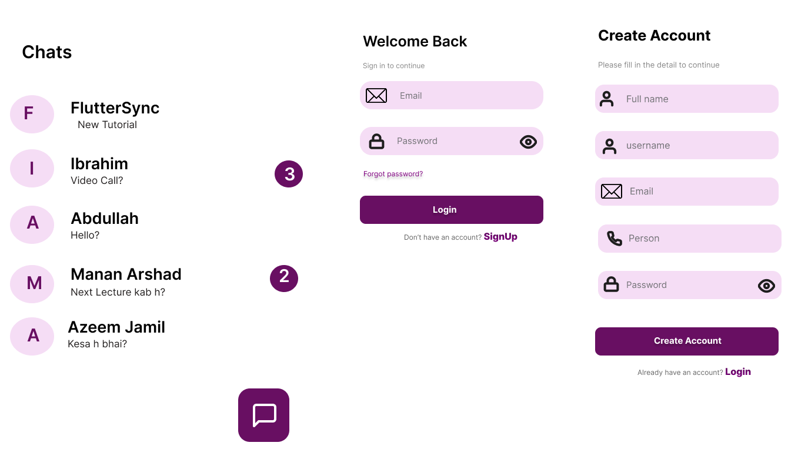

# 💬 Giggl — Real-Time Chat App

<p align="center">
  
</p>

<p align="center">
  
  
  
  
  
  
</p>

---

## 📱 Overviews and Explanation

**Giggl** is a fully-featured real-time chat application built with Flutter and Firebase. It offers a clean, expressive messaging experience with emoji support, secure authentication, and instant message delivery — all wrapped in a modern purple-themed UI.

---

## 📸 Screenshots

| Chats Screen | Login | Sign Up |
|:---:|:---:|:---:|
|  |  |  |

> Add your screenshots to the `assets/screenshots/` folder and they will appear here.

---

## ✨ Features

- 🔐 **Email Authentication** — Secure sign up, login, and email verification via Firebase Auth
- 💬 **Real-Time Messaging** — Instant message delivery powered by Firebase Firestore
- 😄 **Emoji Support** — Full emoji picker integrated into the chat interface
- 🚫 **Block & Unblock Users** — Full user blocking system to manage unwanted contacts
- 🔔 **Unread Message Badges** — Badge counters on chat list for unread messages
- 🧑‍💼 **User Profiles** — Full name, username, and profile setup on registration
- 🔒 **Forgot Password** — Password reset flow via email
- 🎨 **Clean UI** — Custom message bubbles, smooth scroll animations, and purple Material Design theme
- 📱 **Cross-Platform** — Runs on both Android and iOS from a single codebase

---

## 🛠️ Tech Stack

| Layer | Technology |
|---|---|
| Framework | Flutter (Dart) |
| State Management | GetX + BLoC |
| Backend & Database | Firebase Firestore |
| Authentication | Firebase Auth (Email + Email Verification) |
| Real-time Sync | Firestore Streams |
| UI Design | Material Design, Custom Widgets |

---

## 📁 Project Structure

```
giggl_chat_app/
├── lib/
│   ├── controllers/        # GetX controllers
│   ├── models/             # Data models (User, Message)
│   ├── screens/
│   │   ├── auth/           # Login, SignUp, Forgot Password
│   │   ├── chat/           # Chat screen, message bubbles
│   │   └── home/           # Chats list screen
│   ├── services/           # Firebase Auth & Firestore services
│   ├── widgets/            # Reusable custom widgets
│   └── main.dart
├── assets/
│   └── screenshots/
├── pubspec.yaml
└── README.md
```

---

## 🚀 Getting Started

### Prerequisites
- Flutter SDK `>=3.0.0`
- Dart SDK `>=3.0.0`
- A Firebase project set up at [console.firebase.google.com](https://console.firebase.google.com)
- Android Studio or VS Code

### Installation

1. **Clone the repository**
   ```bash
   git clone https://github.com/MuhammadIbrahim732/Giggl-ChatApp.git
   cd Giggl-ChatApp
   ```

2. **Install dependencies**
   ```bash
   flutter pub get
   ```

3. **Set up Firebase**
   - Create a new Firebase project
   - Enable **Email/Password** authentication
   - Enable **Firestore Database**
   - Download `google-services.json` (Android) and place it in `android/app/`
   - Download `GoogleService-Info.plist` (iOS) and place it in `ios/Runner/`

4. **Run the app**
   ```bash
   flutter run
   ```

---

## 🔥 Firebase Setup

Enable the following in your Firebase console:

| Service | Purpose |
|---|---|
| Firebase Auth | User sign up, login, email verification, password reset |
| Cloud Firestore | Storing messages, users, block lists in real time |

### Firestore Collections Structure

```
users/
  {userId}/
    name, username, email, profilePic, blockedUsers[]

chats/
  {chatId}/
    messages/
      {messageId}/
        senderId, text, timestamp, type
```

---

## 📦 Dependencies

```yaml
dependencies:
  flutter:
    sdk: flutter
  firebase_core: latest
  firebase_auth: latest
  cloud_firestore: latest
  get: latest                  # GetX state management
  flutter_bloc: latest         # BLoC pattern
  emoji_picker_flutter: latest # Emoji picker
  intl: latest                 # Date/time formatting
```

---

## 🔒 Security Notes

> ⚠️ The `google-services.json` and `GoogleService-Info.plist` files are **not included** in this repository as they contain private Firebase credentials. You must add your own Firebase project configuration to run this app.

---

## 🗺️ Roadmap

- [ ] Push notifications (FCM)
- [ ] Image & file sharing in chat
- [ ] Online/offline status indicator
- [ ] Group chat support
- [ ] Voice messages
- [ ] Dark mode

---

## 👨‍💻 Author

**Muhammad Ibrahim**

[](https://www.linkedin.com/in/muhammad-ibrahim-4a8425330)
[](https://github.com/MuhammadIbrahim732)
[](mailto:mibrahim.seng@gmail.com)

> BS Software Engineering @ National Textile University, Faisalabad | Flutter Developer | Class of 2026

---

## 📄 License

This project is open source and available under the [MIT License](LICENSE).

---

<p align="center">Built with ❤️ using Flutter & Firebase</p>
